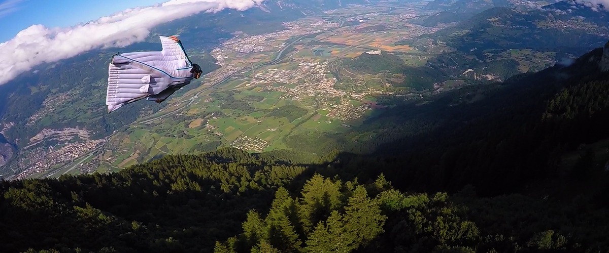

(chap:lecon3)=
# Déplacement et Vitesse

:::{admonition} Objectifs d'apprentissage
:class: objped
À la fin de cette section, vous pourrez :

1. Décrire le mouvement d'un objet dans différents cadres de référence.
2. Définir la distance et le déplacement, et faire la distinction entre les deux
3. Expliquer les relations entre la vitesse instantanée, la vitesse moyenne, le déplacement et le temps.
4. Résoudre des problèmes impliquant la distance le déplacement et la vitesse d'un objet.
:::
 
```{tableofcontents}
```